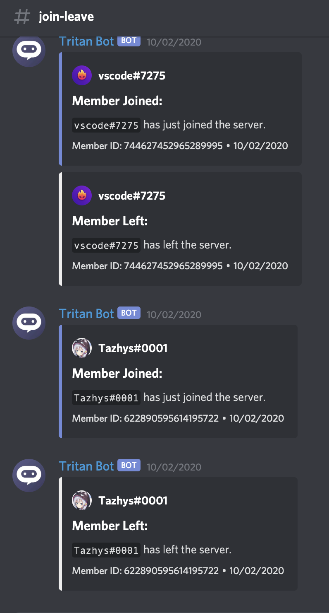

# Join/Leave Logging

You can enable invite logging automatically by creating a channel titled `join-leave`. As long as Tritan has Administrator permissions it will start logging automatically. Please note that at this time, you are unable to change the name of the logging channels.  

