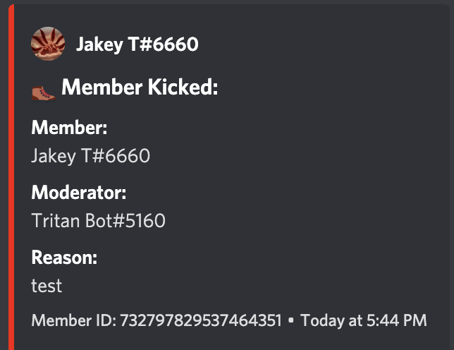
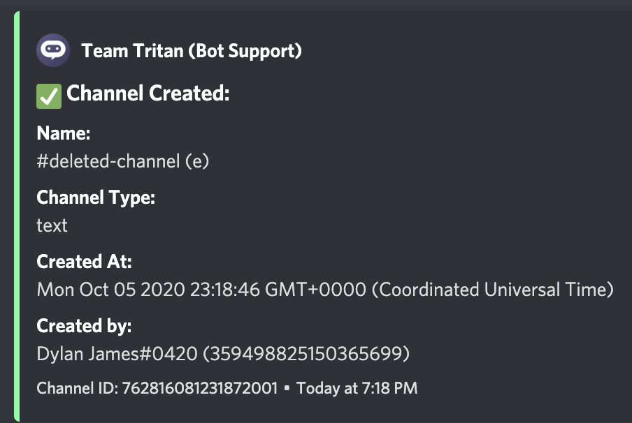
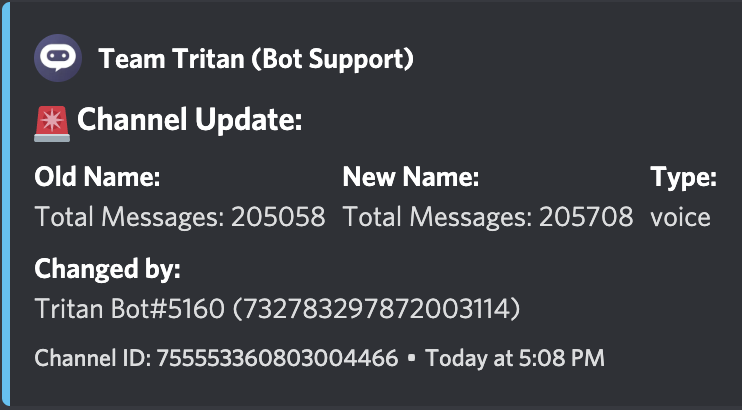
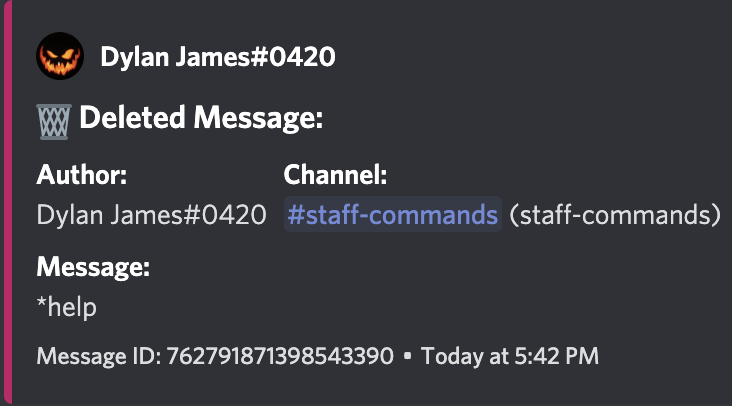

# Event Logging \(Modlogs\)

## **How do I enable modlogs?**

You can enable invite logging automatically by running the following command in your logging channel:  
  
`*setlogs`

 As long as Tritan has Administrator permissions it will create the channel and start logging automatically. Please note that at this time, you are unable to change the name of the logging channels.

**These are just a few of the things that are being logged in my own guild! The list of all events that can be logged is as follows:**

Channel Creation, Channel Deletion, Guild Ban Add, Guild Ban Remove, Join/Leaves, Kicks, Mutes, Warnings, Role Changes, Deleted Messages, Role Creation, Role Modification, Role Deletion

